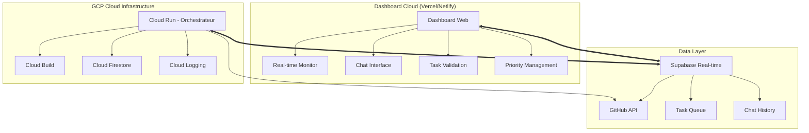

🎯 **DASHBOARD CLOUD + ORCHESTRATEUR GCP**
===========================================

## 📊 **Architecture Complète**



## 🚀 **COMPOSANTS DASHBOARD**

### 1. **Monitor Temps Réel**
- 📊 État orchestrateur (UP/DOWN, cycles, erreurs)
- 📈 Métriques performance (tokens, commits, tâches)
- 🔄 Activité en cours (repo, tâche, progression)
- 📱 Interface responsive épurée

### 2. **Chat Interactif**
- 💬 Discussion directe avec l'orchestrateur
- 🎯 Soumission d'idées et suggestions
- ✅ Validation/refus avec commentaires
- 📝 Historique des conversations

### 3. **Gestion Priorités**
- 🔥 High/Medium/Low priority
- ⏰ Scheduling des tâches
- 📊 Dashboard des suggestions en attente
- 🎨 Interface drag-n-drop pour priorisation

## 🛠️ **STACK TECHNIQUE**

### **Frontend Dashboard**
- **Next.js 14** (App Router, RSC)
- **Tailwind CSS** (design épuré)
- **Shadcn/ui** (composants modernes)
- **Real-time**: Supabase WebSockets
- **Déploiement**: Vercel (gratuit, rapide)

### **Backend Orchestrateur GCP**
- **Cloud Run** (serveur orchestrateur)
- **Cloud Build** (CI/CD automatique)
- **Service Account** (déjà configuré ✅)
- **Cloud Logging** (monitoring avancé)
- **Cloud Scheduler** (keep-alive, cycles)

### **Data & Communication**
- **Supabase** (real-time DB, chat, logs)
- **GitHub API** (repos, commits, PRs)
- **WebSockets** (communication temps réel)
- **Queue System** (tâches, priorités)

## 📋 **MIGRATION PLAN**

### **Phase 1: Dashboard Cloud** (2-3h)
1. Créer Next.js dashboard avec Supabase
2. Interface monitoring temps réel
3. Chat basic avec l'orchestrateur
4. Système validation/priorité simple

### **Phase 2: Orchestrateur GCP** (1-2h)
1. Dockeriser grok_orchestrator.py
2. Configurer Cloud Run + Build
3. Migration secrets et variables
4. Tests de continuité

### **Phase 3: Intégration** (1h)
1. Connexion dashboard ↔ GCP orchestrateur
2. Tests end-to-end
3. Monitoring et alertes
4. Documentation

## 🎨 **DESIGN DASHBOARD**

### **Layout Principal**
```
┌─────────────────────────────────────┐
│ JARVYS Orchestrator Dashboard       │
├─────────────────┬───────────────────┤
│ 🔴 Status: UP   │ 💬 Chat (3)       │
│ 📊 Cycles: 142  │ ✅ Tasks (7)      │
│ ⚡ Last: 2min   │ 🔥 Priority (12)  │
├─────────────────┼───────────────────┤
│                 │                   │
│   Real-time     │   Interactive     │
│   Monitor       │   Controls        │
│                 │                   │
└─────────────────┴───────────────────┘
```

### **Chat Interface**
- Messages style Discord/Slack
- Suggestions avec boutons Approve/Reject
- Priority slider pour chaque suggestion
- Notifications temps réel

### **Monitor Panel**
- Graphiques live (cycles/hour, success rate)
- Log stream en temps réel
- Alertes colorées (rouge=erreur, vert=succès)
- Métriques GitHub (commits, PRs)

## 💰 **COÛTS ESTIMÉS**

### **Gratuit/Très Bas**
- ✅ Vercel (dashboard hosting)
- ✅ Supabase (tier gratuit généreux)
- ✅ GCP Cloud Run (pay-per-use, ~$5-10/mois)
- ✅ GitHub API (déjà utilisé)

### **Total**: **~$5-15/mois** max pour un système autonome 24/7

## 🔒 **AVANTAGES CRITIQUES**

### **Résistance aux Pannes**
- ✅ Codespace DOWN → Orchestrateur continue
- ✅ Redémarrage automatique Cloud Run
- ✅ Logs persistants et monitoring
- ✅ Accès depuis n'importe où

### **Scalabilité**
- ✅ Multiple orchestrateurs simultanés
- ✅ Load balancing automatique
- ✅ Backup/restore facilité
- ✅ Monitoring professionnel

### **Productivité**
- ✅ Contrôle total depuis mobile/laptop
- ✅ Validation asynchrone des idées
- ✅ Priorisation efficace
- ✅ Historique complet des décisions
